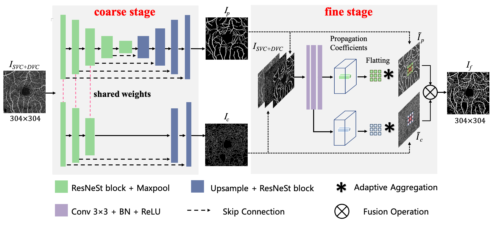

<span id="jump1"></span>
# OCTA-Net: A Two-stage Framework for Vessel Segmentation in OCTA Images


###  [Paper](https://arxiv.org/pdf/2007.05201.pdf) | [BibTex](#jump2)

ROSE: A Retinal OCT-Angiography Vessel Segmentation Dataset and New Model .<br>

[Yuhui Ma](#jump1),  [Huaying Hao](#jump1), [Jianyang Xie](#jump1), [Huazhu Fu](#jump1), [Jiong Zhang](#jump1), [Jianlong Yang](#jump1), [Zhen Wang](#jump1), [Jiang Liu](#jump1), [Yalin Zheng](#jump1) and [Yitian Zhao](#jump1) .<br>

All rights reserved.

The code is released for academic research use only. For commercial use, please contact [yitian.zhao@nimte.ac.cn](#jump1).

<span id="jump2"></span>
### Citation
If you use this code for your research, please cite our papers.
```
@article{ma2020rose,
  title={ROSE: A Retinal OCT-Angiography Vessel Segmentation Dataset and New Model},
  author={Ma, Yuhui and Hao, Huaying and Xie, Jianyang and Fu, Huazhu and Zhang, Jiong and Yang, Jianlong and Wang, Zhen and Liu, Jiang and Zheng, Yalin and Zhao, Yitian},
  journal={arXiv preprint arXiv:2007.05201},
  year={2020}
}
```

